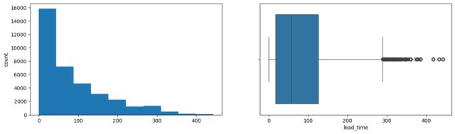
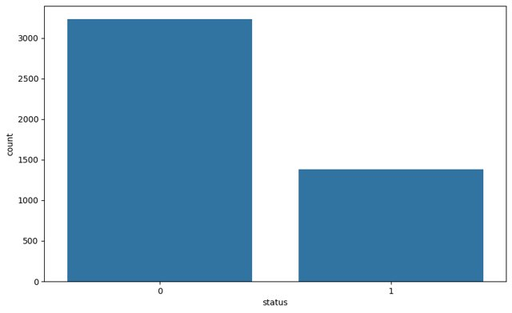
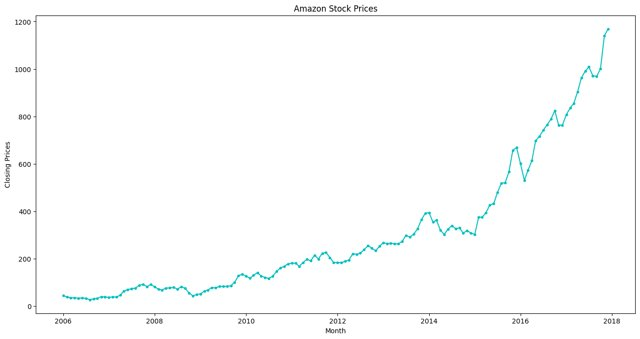

# MIT Machine Learning Projects Portfolio

## 🎓 About
This repository contains my completed machine learning projects from MIT's Professional Education programs. Each project demonstrates practical applications of ML algorithms, data analysis techniques, and model optimization strategies.

**Author:** Mitchell Marfinetz

## 📊 Projects Overview

### 1. [Used Car Price Prediction - Regression Analysis](./01-Regression-Used-Car-Pricing)
**Objective:** Build a pricing model to predict used car prices in the Indian market
- **Techniques:** Linear Regression, Ridge Regression, Decision Trees, Random Forest
- **Key Features:** Power, Year, Engine, Kilometers Driven
- **Best Model:** Linear Regression (R² = 0.87 on test set)
- **Business Impact:** Enables data-driven pricing strategies for the emerging used car market

### 2. [Boston Housing Price Prediction](./02-Boston-Housing-Prediction)  
<br>

**Objective:** Predict housing prices in Boston using multiple regression techniques
- **Techniques:** Multiple Linear Regression, Feature Engineering
- **Dataset:** Boston Housing Dataset
- **Applications:** Real estate valuation, market analysis

### 3. [Machine Learning Classification](./03-Classification-ML)
<br>

**Objective:** Implement and compare various classification algorithms
- **Techniques:** Logistic Regression, SVM, Decision Trees, Random Forest
- **Evaluation:** Accuracy, Precision, Recall, F1-Score, ROC-AUC
- **Applications:** Binary and multi-class classification problems

### 4. [Classification - Practical Data Science](./04-Classification-PDS)
<br>

**Objective:** Apply classification techniques to real-world datasets
- **Focus:** Feature selection, cross-validation, hyperparameter tuning
- **Techniques:** Ensemble methods, gradient boosting
- **Emphasis:** Model interpretability and business insights

### 5. [Time Series Analysis](./05-Time-Series-Analysis)
<br>

**Objective:** Forecast time-dependent data using statistical methods
- **Techniques:** ARIMA, Seasonal Decomposition, Exponential Smoothing
- **Applications:** Demand forecasting, trend analysis
- **Evaluation:** RMSE, MAE, MAPE

### 6. [Unsupervised Learning](./06-Unsupervised-Learning)
<br>

**Objective:** Discover patterns in unlabeled data
- **Techniques:** K-Means, Hierarchical Clustering, PCA, t-SNE
- **Applications:** Customer segmentation, anomaly detection
- **Evaluation:** Silhouette score, elbow method

### 7. [SVHN Deep Learning](./07-SVHN-Deep-Learning)
<br>

**Objective:** Classify Street View House Numbers using deep learning
- **Techniques:** Convolutional Neural Networks (CNN), Neural Networks
- **Dataset:** Google Street View House Numbers (SVHN)
- **Architecture:** Multi-layer CNN with dropout and batch normalization
- **Performance:** High accuracy on multi-digit recognition

## 🛠️ Technologies & Libraries

- **Languages:** Python 3.x
- **Data Processing:** NumPy, Pandas, SciPy
- **Machine Learning:** Scikit-learn, XGBoost
- **Deep Learning:** TensorFlow, Keras
- **Visualization:** Matplotlib, Seaborn, Plotly
- **Statistical Analysis:** Statsmodels

## 📈 Key Skills Demonstrated

- **Data Preprocessing:** Handling missing values, outlier detection, feature scaling
- **Feature Engineering:** Creating derived features, log transformations, encoding categorical variables
- **Model Selection:** Cross-validation, grid search, performance metrics comparison
- **Model Optimization:** Hyperparameter tuning, regularization, ensemble methods
- **Business Insights:** Translating model results into actionable recommendations

## 🚀 Getting Started

Each project folder contains:
- Jupyter Notebook with full code and analysis
- Dataset (where applicable)
- Detailed README with project-specific information
- Requirements.txt for dependencies

To run any project:
```bash
# Clone the repository
git clone https://github.com/[your-username]/MIT-ML-Projects.git

# Navigate to specific project
cd MIT-ML-Projects/[project-folder]

# Install dependencies
pip install -r requirements.txt

# Open Jupyter Notebook
jupyter notebook [notebook-name].ipynb
```

## 📊 Results Summary

| Project | Best Model | Performance Metric | Score |
|---------|-----------|-------------------|-------|
| Used Car Pricing | Linear Regression | R² (test) | 0.868 |
| Boston Housing | Multiple Regression | R² | TBD |
| Classification ML | Random Forest | Accuracy | TBD |
| Classification PDS | Ensemble | F1-Score | TBD |
| Time Series | ARIMA | RMSE | TBD |
| Unsupervised | K-Means | Silhouette | TBD |
| SVHN | CNN | Accuracy | TBD |

## 📝 Key Learnings

1. **Feature importance varies by domain** - In used car pricing, power and year were critical; in housing, location and square footage dominate
2. **No single algorithm fits all** - Linear models excel with linear relationships, while tree-based methods handle non-linearity
3. **Data quality matters** - Proper preprocessing and feature engineering often improve performance more than algorithm selection
4. **Business context is crucial** - The best model isn't always the most complex; interpretability and actionability matter


## 📫 Contact

**Mitchell Marfinetz**
- GitHub: [@mmarfinetz](https://github.com/[your-username])
- LinkedIn: [Mitchell Marfinetz](https://linkedin.com/in/[your-linkedin])

## 🙏 Acknowledgments

- MIT Professional Education for the comprehensive curriculum
- Course instructors for their guidance and feedback
- Open-source community for the amazing tools and libraries

---
*These projects were completed as part of MIT's Professional Education programs in Machine Learning and Data Science.*

## Executed Notebooks

- [CNN_Project_Learner_Notebook_SVHN (1)](<07-SVHN-Deep-Learning/CNN_Project_Learner_Notebook_SVHN (1)-executed.ipynb>)  
  <br>
  
- [Learner+Notebook+-+Project_Classification_ML](<03-Classification-ML/Learner+Notebook+-+Project_Classification_ML-executed.ipynb>)  
  <br>
  
- [Learner_Notebook_Classification_PDS](<04-Classification-PDS/Learner_Notebook_Classification_PDS-executed.ipynb>)  
  <br>
  
- [Learner_Notebook_Project_Time_Series](<05-Time-Series-Analysis/Learner_Notebook_Project_Time_Series-executed.ipynb>)  
  <br>
  
- [Learner_Notebook_Unsupervised_Learning_Project_(1) (1)](<06-Unsupervised-Learning/Learner_Notebook_Unsupervised_Learning_Project_(1) (1)-executed.ipynb>)  
  <br>
  
- [Learners_Notebook_Boston_house_price (1)](<02-Boston-Housing-Prediction/Learners_Notebook_Boston_house_price (1)-executed.ipynb>)  
  <br>
  

## Data Files Present
- `Boston.csv`
- `ExtraaLearn.csv`
- `INNHotelsGroup.csv`
- `amazon_stocks_prices.xlsx`
- `ratings_Electronics.csv`
- `SVHN_data.h5`

## Notes
- All notebooks use real datasets; no synthetic fallbacks.
